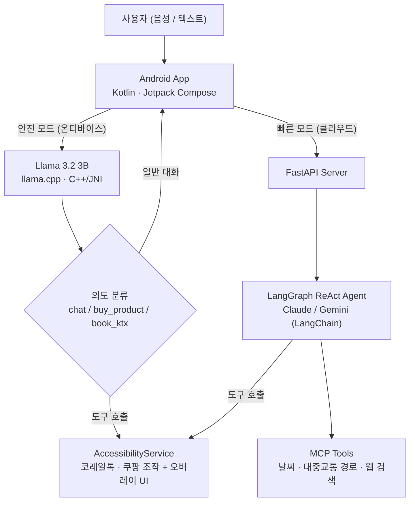
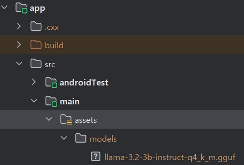

# HelpAgent

> **디지털 취약계층의 앱 사용을 대신 수행하는 Android AI 에이전트**
> "부산 가는 기차표 예매해줘" 한마디면, 에이전트가 코레일톡을 직접 조작합니다.
> 온디바이스 LLM(Llama 3.2 3B)과 클라우드 LangGraph 에이전트를 결합한 하이브리드 구조.


<!-- TODO: 데모 GIF 또는 대표 스크린샷 1장 -->

---

## 프로젝트 소개

기차 예매, 온라인 쇼핑 같은 일상 업무가 모바일 앱 중심으로 옮겨갔지만, 고령층 등 디지털 기기가 익숙하지 않은 사용자에게는 여전히 높은 진입 장벽입니다. HelpAgent는 사용자가 음성이나 텍스트로 요청하면 **에이전트가 실제 앱(코레일톡, 쿠팡)을 대신 조작**해 업무를 완수하는 Android 앱입니다.

종합설계(캡스톤) 3인 팀 프로젝트로 개발했습니다.

## 주요 기능

**실제 앱 자동 조작** — AccessibilityService 기반으로 코레일톡(기차 예매), 쿠팡(상품 검색·구매)을 에이전트가 직접 조작합니다. 진행 단계별 안내와 취소·입력이 가능한 오버레이 UI를 통해, 자동화 중에도 사용자가 상황을 확인하고 개입할 수 있습니다.

**정보 조회 도구 (MCP)** — 날씨(Open-Meteo), 대중교통 경로(ODsay), 웹 검색(네이버 검색 API)을 MCP 서버로 래핑해 에이전트 도구로 제공합니다.

**하이브리드 추론** — 온디바이스 모델(Llama 3.2 3B)이 처리하는 안전 모드와 클라우드 LangGraph 에이전트를 사용하는 빠른 모드를 제공합니다. 코레일톡·쿠팡 자동 조작은 두 모드 모두에서 동작하며, 모드별 테마 컬러로 현재 상태를 즉시 구분할 수 있습니다.

**접근성 중심 UI** — 음성·터치 중심의 채팅 인터페이스. 경로 안내 등 도구 호출 결과는 평문 대신 네이티브 카드 UI로 구조화해 렌더링합니다.

## 아키텍처



서버 코드는 별도 저장소에서 관리합니다: [helpagent-server](<!-- TODO: 서버 레포 링크 -->)

## 성능

| 항목 | 개선 전 | 개선 후 | 방법 |
|---|---|---|---|
| 프리필 레이턴시 (TTFT) | 5,400ms | **870ms (−84%)** | 시스템 프롬프트 KV 캐싱 (C++/JNI) |
| 단일 요청 라우팅 정확도 | 95.7% | **97.4%** | 평가 하네스 기반 반복 개선 |
| 복합 요청 커버리지 | 83.3% | **92.9%** | 평가 하네스 기반 반복 개선 |

라우팅 정확도·커버리지는 자체 구축한 **120케이스 평가 하네스** 기준입니다. 단일 요청과 복합 요청 시나리오로 구성해, 개선 작업마다 동일한 기준으로 전후를 비교 측정했습니다.

### 최적화 과정: 측정 → 병목 특정 → 해결

**1. Vulkan GPU 오프로딩 실험** — llama.cpp의 Vulkan 백엔드로 연산을 GPU에 오프로딩했지만 토큰 생성 속도 개선은 약 8%에 그쳤습니다. 원인을 분석한 결과, 모바일 SoC는 UMA(Unified Memory Architecture) 구조로 CPU·GPU가 동일한 LPDDR 대역폭을 공유하며, 토큰 생성 단계는 연산이 아닌 메모리 대역폭이 병목(memory-bound)이라 연산 유닛을 옮겨도 이득이 제한적이었습니다.

**2. 중복 연산 제거로 방향 전환** — 연산 오프로딩 대신, 매 요청마다 반복 처리되던 고정 시스템 프롬프트 구간의 KV 상태를 C++/JNI 레벨에서 캐싱해 재사용하도록 구현했습니다. 그 결과 프리필 레이턴시를 5,400ms에서 870ms로 84% 단축했습니다.

**3. 메모리 최적화** — KV Cache Q8 양자화를 적용해 온디바이스 추론의 메모리 점유를 절감했습니다.

## 기술 스택

| 영역 | 스택 |
|---|---|
| Android | Kotlin, Jetpack Compose, AccessibilityService, SpeechRecognizer (음성 입력) |
| 온디바이스 추론 | llama.cpp, C++ / JNI, Llama 3.2 3B, Vulkan backend |
| 서버 | Python, FastAPI, LangGraph (ReAct), LangChain, MCP |
| 클라우드 LLM | Claude / Gemini (LangChain 추상화로 전환 가능) |
| 외부 API | Open-Meteo, ODsay, 네이버 검색 |

## 팀 구성 및 담당 역할

3인 팀 프로젝트. **본인 담당:**

- 온디바이스 모델 적재·추론 최적화 — llama.cpp 통합, JNI 브리지, 시스템 프롬프트 KV 캐싱, Vulkan 백엔드 실험 및 병목 분석
- MCP 도구 개발 — 날씨·대중교통 경로·웹 검색
- 앱 자동화 — AccessibilityService 기반 코레일톡·쿠팡 조작, 오버레이 UI
- 채팅 UI/UX 설계 및 앱 통합

서버 측 LangGraph 에이전트 설계·구현은 팀원이 담당했습니다.

## 스크린샷

<!-- TODO: 채팅 UI / 모드별 화면 / 코레일톡·쿠팡 자동화 오버레이 스크린샷 -->

## 실행 방법

<!-- TODO: 실제 빌드 환경에 맞게 수정 -->

1. 이 저장소를 클론하고 Android Studio로 엽니다.
2. GGUF 형식의 Llama 3.2 3B 모델 파일을 지정 경로에 배치합니다. <!-- TODO: 경로 명시 -->
3. 빠른 모드 사용 시 [helpagent-server](<!-- TODO -->)를 실행하고 서버 주소를 설정합니다.
4. 앱 실행 후 접근성 권한을 허용하면 앱 자동 조작 기능을 사용할 수 있습니다.


# 사용방법
```
git clone https://github.com/qkrCksDlf/ondevice-accessibility-agent.git

cd ondevice-accessibility-agent
```
---
이후 app/src/main/cpp폴더 안에 llama.cpp를 다운받아야함. 그냥 최신버전은 안되고 b4500 버전 이용.
```
cd app/src/main/cpp
git clone https://github.com/ggerganov/llama.cpp
cd llama.cpp

# 3. b4500 태그로 체크아웃
git checkout b4500

# 4. 서브모듈 초기화 (필요시)
git submodule update --init --recursive
```
---
이후 허깅페이스에서 모델 다운 후 app/src/main 안에 assets폴더를 만듭니다. (폴더 이름을 assets로)
그리고 그 assets폴더 안에 models폴더를 만들고 그 안에 넣으시면 됩니다.




llama-3.2-3b-instruct-q4_k_m.gguf를 다운받으시면 됩니다. 
혹은 다른 모델 사용하고 싶으시면 그 모델을 다운 받아서 옮긴 후 메인엑티비티.kt에서 MODEL_ASSET_PATH찾으신 후 해당 모델 이름에 맞게 바꿔주세요.
